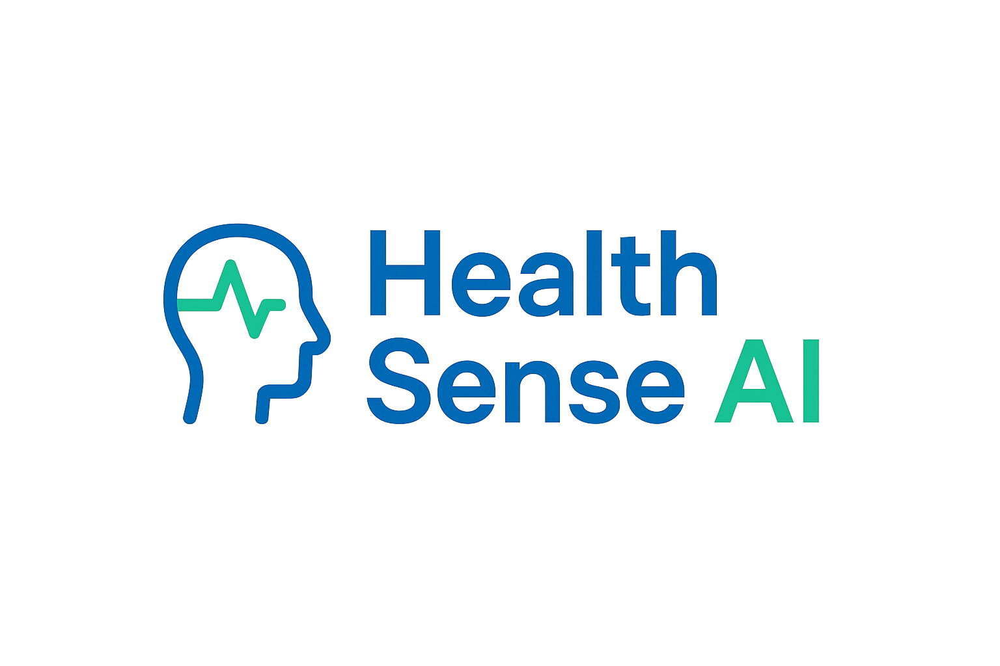

<div align="center">
  
</div>

<div align="center">
  <h3>🌟 Your AI-Powered Health Companion 🌟</h3>
</div>

## 🚀 About The Project

HealthSense AI is a cutting-edge virtual healthcare platform that leverages AI to provide personalized health management. Built with Streamlit and powered by the Groq API, it offers intuitive tools for medical consultations, nutrition planning, health tracking, and emergency resources.

### ✨ Key Features

- 🤖 **AI Doctor Chat**: Get instant medical advice from an AI-powered doctor, available 24/7.
- 📊 **Health Tracking**: Monitor weight, blood pressure, heart rate, and blood glucose with interactive visualizations.
- 🥗 **Nutrition Planner**: Generate personalized meal and exercise plans based on your goals and profile.
- 🏋️‍♂️ **BMI Calculation**: Calculate and track your Body Mass Index with health insights.
- 📝 **PDF Reports**: Download consultation and nutrition plans as professional PDF reports.
- 💬 **Interactive Interface**: User-friendly design with a modern, responsive UI.
- 🚨 **Emergency Services**: Quick access to emergency contacts and guidelines.

## 🛠️ Built With

- 
- 
- 
- 
- 
- 

## 👨‍💻 Meet The Developer

<table>
  <tr>
    <td align="center">
      <a href="https://www.linkedin.com/in/muhammad-rizwan-link/"><br /><sub><b>Muhammad Rizwan</b><br></sub></a><br />
      <a href="https://www.linkedin.com/in/muhammad-rizwan-link/"></a>
      <a href="https://github.com/rizwan-muhammad-ai"></a>
    </td>
  </tr>
</table>

## 📱 UI Interface

<div align="center">
  
  
  
</div>

## 🚀 Getting Started

1. **Clone the Repository**:
   ```bash
   git clone https://github.com/rizwan-muhammad-ai/HealthSense-AI.git
   cd HealthSense-AI
   ```

2. **Install Dependencies**:
   ```bash
   pip install -r requirements.txt
   ```
   Ensure `requirements.txt` contains:
   ```
   streamlit
   groq
   streamlit-option-menu
   fpdf
   plotly
   pandas
   ```

3. **Set Up Secrets**:
   - Create a `secrets.toml` file in the project root:
     ```toml
     [secrets]
     groq_api_key = "your-groq-api-key-here"
     ```
   - Obtain your Groq API key from [x.ai/api](https://x.ai/api).

4. **Run the Application**:
   ```bash
   streamlit run app.py
   ```
   - Open `http://localhost:8501` in your browser to view the app.

## ☁️ Deployment on Streamlit Community Cloud

1. **Push to GitHub**:
   ```bash
   git add .
   git commit -m "Update project files"
   git push origin main
   ```

2. **Create a Streamlit App**:
   - Sign in to [Streamlit Community Cloud](https://streamlit.io/cloud) with your GitHub account.
   - Click **New app**, select `rizwan-muhammad-ai/HealthSense-AI`, and choose the `main` branch.
   - Set the main Python file to `app.py`.

3. **Add Secrets**:
   - In **Advanced settings**, add:
     ```toml
     [secrets]
     groq_api_key = "your-groq-api-key-here"
     ```

4. **Deploy**:
   - Click **Deploy** to launch your app. Access it via the provided URL (e.g., `https://healthsense-ai.streamlit.app`).

## 🔒 Privacy and Data Security

- **Local Storage**: Health data and chat history are stored in your browser’s session.
- **API Security**: The Groq API processes queries without retaining personal data.
- **Confidentiality**: Your privacy is our priority, with no server-side storage unless explicitly saved.

## 🤝 Contributing

1. Fork the repository.
2. Create a feature branch (`git checkout -b feature/your-feature`).
3. Commit changes (`git commit -m "Add your feature"`).
4. Push to your fork (`git push origin feature/your-feature`).
5. Open a pull request.

## ⚠️ Disclaimer

HealthSense AI is not a substitute for professional medical advice, diagnosis, or treatment. Always consult a qualified healthcare provider for medical concerns.

## 📬 Contact

For feedback or support, open an issue on GitHub or email [rizwan@example.com](mailto:rizwan@example.com).

<div align="center">
  <p>Made with ❤️ by Muhammad Rizwan</p>
  <p>© 2025 HealthSense AI. All rights reserved.</p>
</div>
